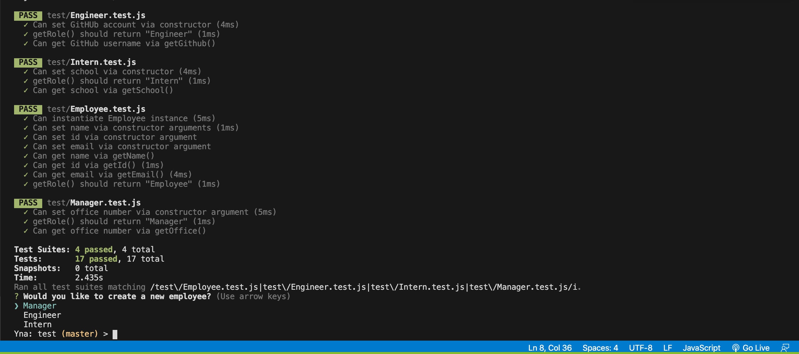
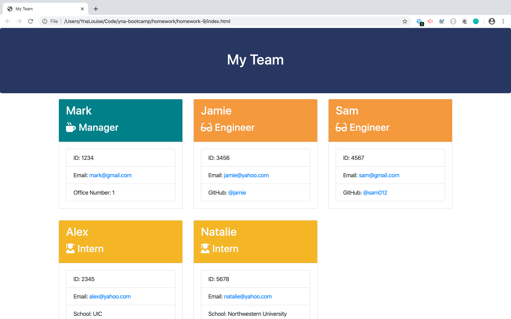

# Employee Summary Template

## Project Description:
Created a Node CLI that creates employee information by prompting related questions and then generates those information in an HTML file that can be viewed using a browser. The end result would be a summary of different employees along with their respective information.

## Installation:
* NPM Inquirer

## Usage:
The person in-charge of creating this employee summary would be the one answering the prompts and adding multiple employees until every employee is included.

## Contributing:
* Colin Goodale (https://github.com/colingoodale)
* NPM Inquirer

## Test:
Below is a preview of the test that was run:

## Project Preview:
The website looks like the image below:

